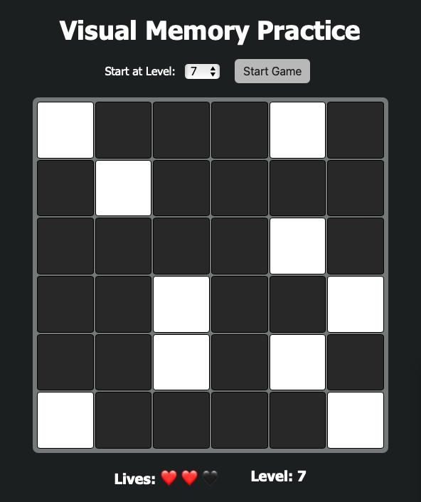

# visual-memory
A customizable web-based visual memory test inspired by the Human Benchmark game.

## Features
- Start from any level (1, 3, 5, 7, 10)
- Responsive tile grid with increasing difficulty
- Life tracking and level progression
- Clean, interactive UI with fast feedback

## How It Works

* At each level, a pattern of white tiles is shown briefly.
* After the tiles disappear, click to recall the correct positions.
* Lose a life if you make a mistake. Lose all 3 and restart.

## Demo

